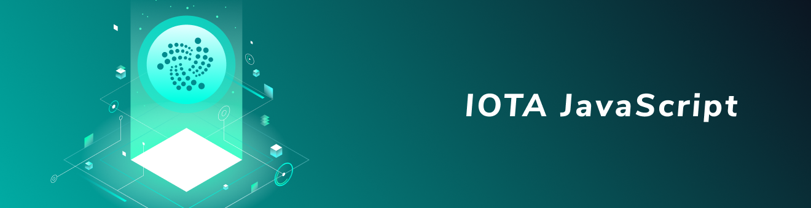

<h1 align="center">
  <br>
  <a href="https://docs.iota.org/docs/client-libraries/0.1/getting-started/java-quickstart"></a>
</h1>

<h2 align="center">The official JavaScript client library for interacting with the Tangle</h2>

<p align="center">
    <a href="https://docs.iota.org/docs/client-libraries/0.1/getting-started/js-quickstart">
    
    <a href="https://discord.iota.org/">
    
    <a href="https://iota.stackexchange.com/">
    
    <a href="https://raw.githubusercontent.com/iotaledger/iota.lib.js/master/LICENSE">
    
    <a href="https://docs.iota.org/docs/node-software/0.1/iri/references/api-reference">
    
    <a href="https://greenkeeper.io/">
    
    <a href="https://travis-ci.org/iotaledger/iota.js">
    
</p>
      
<p align="center">
  <a href="#about">About</a> ◈
  <a href="#prerequisites">Prerequisites</a> ◈
  <a href="#installation">Installation</a> ◈
  <a href="#getting-started">Getting started</a> ◈
  <a href="#api-reference">API reference</a> ◈
  <a href="#examples">Examples</a> ◈
  <a href="#supporting-the-project">Supporting the project</a> ◈
  <a href="#joining-the-discussion">Joining the discussion</a> 
</p>

---

## About

This is the **official** JavaScript client library, which allows you to do the following:
* Create transactions
* Sign transactions
* Generate addresses
* Interact with an IRI node

This is beta software, so there may be performance and stability issues.
Please report any issues in our [issue tracker](https://github.com/iotaledger/iota.js/issues/new).

## Prerequisites

To use the library, your computer must have one of the following [supported](https://github.com/iotaledger/iota.js/blob/next/.travis.yml#L5) versions of [Node.js](https://nodejs.org):
* Node.js 10 or higher. Recommended version is [latest LTS](https://nodejs.org/en/download/).
* Node.js 8

To install [library packages](https://www.npmjs.com/org/iota), your computer must have one of the following package managers:

* [npm](https://www.npmjs.com/) (Included in Node.js [downloads](https://nodejs.org/en/download/))
* [Yarn](https://yarnpkg.com/)

A `package.json` file is required. It can be generated with [`npm init`](https://docs.npmjs.com/cli/init) or [`yarn init`](https://yarnpkg.com/lang/en/docs/cli/init/)

## Installation

To install the IOTA JavaScript client library and its dependencies, you can use one of the following options:

* Install the library with npm
    ```bash
    npm install @iota/core
    ```
* Install the library with Yarn
    ```bash
    yarn add @iota/core
    ```

## Getting started

After you've [installed the library](#installation), you can connect to an IRI and interface with it.

An extended guide can be found on our [documentation portal](https://docs.iota.org/docs/client-libraries/0.1/getting-started/js-quickstart), we strongly recommend you to go here for starting off. A quick starting tutorial is shown below.

To connect to a local IRI node, do the following:

```js
import { composeAPI } from '@iota/core'

const iota = composeAPI({
    provider: 'http://localhost:14265'
})

iota.getNodeInfo()
    .then(info => console.log(info))
    .catch(error => {
        console.log(`Request error: ${error.message}`)
    })
```

## API reference

For details on all available API methods, see the [reference page](api_reference.md).


* [.composeApi([settings])](api_reference.md#module_core.composeApi)

* [.addNeighbors(uris, [callback])](api_reference.md#module_core.addNeighbors)

* [.attachToTangle(trunkTransaction, branchTransaction, minWeightMagnitude, trytes, [callback])](api_reference.md#module_core.attachToTangle)

* [.broadcastBundle(tailTransactionHash, [callback])](api_reference.md#module_core.broadcastBundle)

* [.broadcastTransactions(trytes, [callback])](api_reference.md#module_core.broadcastTransactions)

* [.checkConsistency(transactions, [options], [callback])](api_reference.md#module_core.checkConsistency)

* [.findTransactionObjects(query, [callback])](api_reference.md#module_core.findTransactionObjects)

* [.findTransactions(query, [callback])](api_reference.md#module_core.findTransactions)

* [.getAccountData(seed, options, [callback])](api_reference.md#module_core.getAccountData)

* [.getBalances(addresses, threshold, [callback])](api_reference.md#module_core.getBalances)

* [.getBundle(tailTransactionHash, [callback])](api_reference.md#module_core.getBundle)

* [.getInclusionStates(transactions, tips, [callback])](api_reference.md#module_core.getInclusionStates)

* [.getInputs(seed, [options], [callback])](api_reference.md#module_core.getInputs)

* [.getLatestInclusion(transactions, tips, [callback])](api_reference.md#module_core.getLatestInclusion)

* [.getNeighbors([callback])](api_reference.md#module_core.getNeighbors)

* [.getNewAddress(seed, [options], [callback])](api_reference.md#module_core.getNewAddress)

* [.getNodeInfo([callback])](api_reference.md#module_core.getNodeInfo)

* [getTips([callback])](api_reference.md#module_core.getTips)

* [getTransactionObjects(hashes, [callback])](api_reference.md#module_core.getTransactionObjects)

* [.getTransactionsToApprove(depth, [reference], [callback])](api_reference.md#module_core.getTransactionsToApprove)

* [.getTrytes(hashes, [callback])](api_reference.md#module_core.getTrytes)

* [.isPromotable(tail, [callback])](api_reference.md#module_core.isPromotable)

* [.prepareTransfers(seed, transfers, [options], [callback])](api_reference.md#module_core.prepareTransfers)

* [.promoteTransaction(tail, depth, minWeightMagnitude, transfer, [options], [callback])](api_reference.md#module_core.promoteTransaction)

* [.removeNeighbors(uris, [callback])](api_reference.md#module_core.removeNeighbors)

* [.replayBundle(tail, depth, minWeightMagnitude, [callback])](api_reference.md#module_core.replayBundle)

* [.sendTrytes(trytes, depth, minWeightMagnitude, [reference], [callback])](api_reference.md#module_core.sendTrytes)

* [.storeAndBroadcast(trytes, [callback])](api_reference.md#module_core.storeAndBroadcast)

* [.storeTransactions(trytes, [callback])](api_reference.md#module_core.storeTransactions)

* [.traverseBundle(trunkTransaction, [bundle], [callback])](api_reference.md#module_core.traverseBundle)

* [.generateAddress(seed, index, [security], [checksum])](api_reference.md#module_core.generateAddress)

## Examples

As well as the following examples, you can take a look at our [examples directory](https://github.com/iotaledger/iota.js/tree/next/examples) for more.

## Supporting the project

If the IOTA JavaScript client library has been useful to you and you feel like contributing, consider posting a [bug report](https://github.com/iotaledger/iota.js/issues/new), [feature request](https://github.com/iotaledger/iota.js/issues/new) or a [pull request](https://github.com/iotaledger/iota.js/pulls/).  

### Cloning and bootstrapping the repository on GitHub

1. Click the <kbd>Fork</kbd> button in the top-right corner
2. Clone your fork and change directory into it
3. Bootstrap your environment by doing the following:

    ```bash
    npm run init
    ```

This step will download all dependencies, build and link the packages together. iota.js uses [Lerna](https://lerna.js.org/) to manage multiple packages. You can re-bootstrap your setup at any point with `lerna bootstrap` command.

### Running tests

Make your changes on a single package or across multiple packages and test the system by running the following from the root directory:

```bash
npm test
```
To run tests of specific package, change directory into the package's directory and run `npm test` from there.

### Updating documentation

Please update the documention when needed by editing [`JSDoc`](http://usejsdoc.org) annotations and running `npm run docs` from the root directory.

## Joining the discussion

If you want to get involved in the community, need help with getting setup, have any issues related with the library or just want to discuss IOTA, Distributed Registry Technology (DRT) and IoT with other people, feel free to join our [Discord](https://discord.iota.org/).
